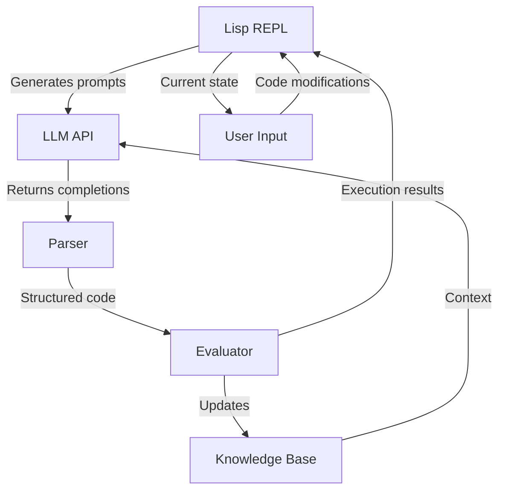

# Bidirectional Code Generation Flow

```mermaid
graph TD
    A[Lisp REPL] -->|Generates prompts| B[LLM API]
    B -->|Returns completions| C[Parser]
    C -->|Structured code| D[Evaluator]
    D -->|Execution results| A
    
    E[User Input] -->|Code modifications| A
    A -->|Current state| E
    
    F[Knowledge Base] -->|Context| B
    D -->|Updates| F
```
